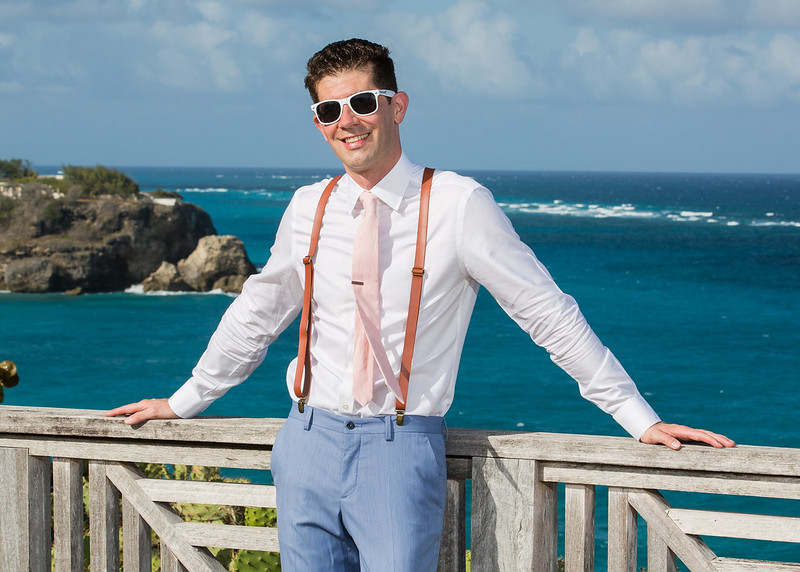

# resume

## Bio

Soccer & soca aficionado.  European born, Caribbean at heart.

Worked for 4 years at a web startup in Washington, D.C. prior to joining Bloomberg LP.  At Bloomberg I've always been part of the Derivatives Team, creating products such as OVME, OVME Backtesting, OVME Uploader and more recently: Derivatives API.  For recruiting I am both the University of Florida & Mid-Atlantic Regional captain.

On the side I enjoy playing & watching soccer, listening to soca music, and working on my countless personal projects.  I have a passion for watches, travel & sneakers.  Hit me up on my website or Medium to find out more!

## Creator

[Peter Szocs](http://www.peterszocs.com), Tech Lead at Bloomberg LP.

* http://www.peterszocs.com/
* https://medium.com/@pitanyc
* https://github.com/pitanyc
* https://www.linkedin.com/in/szocspeter
